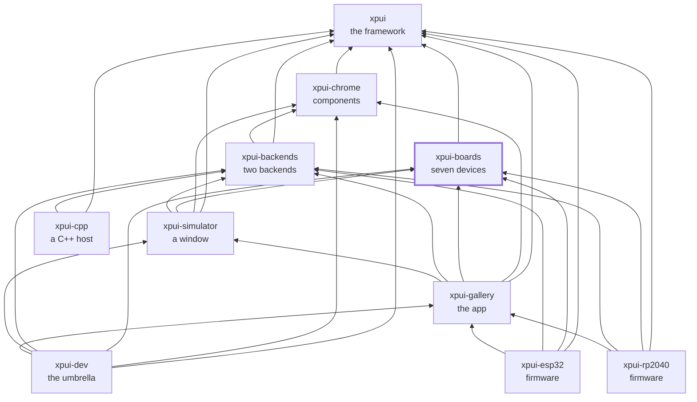

# `xpui-boards`

> ⚠️ **Under heavy development.** Not production-ready. The API can break
> without notice. Use at your own risk.

Seven e-ink devices, as data: panel size, orientation, key row, refresh time,
and the body in tenths of a millimetre.

Nothing here draws anything. A board is what an application *injects* into a
backend and a simulator, which is why the framework can describe a device it
has never heard of and why adding one is a literal rather than a patch.

## Which crate you want

| | |
|---|---|
| [`pimoroni`](pimoroni/) | Badger 2040, Tufty 2040, Inky Frame. The first two ship firmware and have been run over a debug probe; the Inky Frame's 600 × 448 seven-colour panel is described so a screen can be laid out for it and seen in the simulator |
| [`xteink`](xteink/) | X3, X4, X4 Pro |
| [`seeed`](seeed/) | Sticky |
| [`core`](core/) | `Board`, `Orientation`, `Bezel`, and the `Plan`/`Run`/`Key` const DSL. Describes no device at all |

**Take the vendors you target and none of the others.** That is why there is a
crate per manufacturer rather than one list: a firmware for a Badger has no
reason to compile an X4's dimensions into its image, and one crate cannot be
taken a vendor at a time.

There is deliberately no `ALL` across vendors. An application that ships
against more than one concatenates the three, and
[`xpui-gallery`](https://github.com/XPUI-Framework/xpui-gallery/blob/main/gallery/src/boards.rs)
is the worked example — a `const` assertion there fails if a vendor gains or
loses a board and that list does not follow.

## Your board is not here

[**docs/adding-a-board.md**](docs/adding-a-board.md) walks the whole of it
against a real device: the three numbers from the datasheet, the key row, the
body, and what proves it. Every snippet on that page is checked against the
constant it copies.

## What it depends on, and what depends on it

Only [`xpui`](https://github.com/XPUI-Framework/xpui-framework), for `Button`
and `KeyRow` — a key is a fact about hardware, and the crate describing a
device should not have to depend on the one drawing it to say so. Nothing else
in the organisation, which is the point.

Used by [`xpui-simulator`](https://github.com/XPUI-Framework/xpui-simulator),
[`xpui-gallery`](https://github.com/XPUI-Framework/xpui-gallery),
[`xpui-rp2040`](https://github.com/XPUI-Framework/xpui-rp2040) and
[`xpui-esp32`](https://github.com/XPUI-Framework/xpui-esp32) — every one of
them a caller, never a library below one.

## Checking it

```bash
./build-and-test.sh
```

The checks themselves are in [`xtask/`](xtask/) — this repository's own list,
in Rust, holding nothing it does not run. `./build-and-test.sh fix` formats
in place first.

## Where it sits

Every arrow is a dependency in a `Cargo.toml`, and they all point inward
toward `xpui`, which depends on nothing at all. That is the rule the
organisation is arranged around: a backend can be written without the framework
knowing it exists, and a firmware reaches whatever it needs directly rather
than through whoever happens to sit above it.



## License

MIT — see [LICENSE](LICENSE). Copyright (c) 2026 Thiago Holanda.
