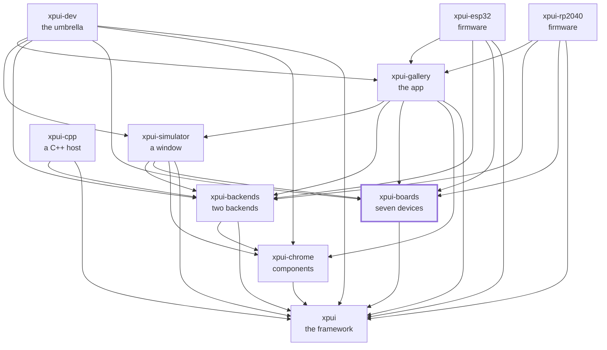

[](https://github.com/XPUI-Framework/xpui-boards/actions/workflows/ci.yml) [](LICENSE)

<picture>
  <source media="(prefers-color-scheme: dark)" srcset="assets/logo-black.png">
  
</picture>

# Boards

> [!WARNING]
> Under heavy development. Not production-ready. The API can break without
> notice. Use at your own risk.

Seven devices — six e-ink panels and one LCD — as data: panel size,
orientation, key row, refresh time, and the body in tenths of a millimetre. Nothing here draws anything. A board
is what an application _injects_ into a backend and a simulator, which is why
the framework can describe a device it has never heard of and why adding one
is a literal rather than a patch.

Every document in this repository is listed in [docs/README.md](docs/README.md).

## Which crate you want

|                         |                                                                                                                                                                                                                                |
| ----------------------- | ------------------------------------------------------------------------------------------------------------------------------------------------------------------------------------------------------------------------------ |
| [`pimoroni`](pimoroni/) | [Badger 2040](https://shop.pimoroni.com/products/badger-2040), [Tufty 2040](https://shop.pimoroni.com/products/tufty-2040), [Inky Frame](https://shop.pimoroni.com/products/inky-frame-5-7). The first two ship firmware and have been run over a debug probe; the Inky Frame's 600 × 448 seven-colour panel is described so a screen can be laid out for it and seen in the simulator |
| [`xteink`](xteink/)     | [X3](https://www.xteink.com/products/xteink-x3), X4, [X4 Pro](https://www.xteink.com/products/xteink-x4-pro-pocket-ereader)                                                                                                                                                                                                                 |
| [`seeed`](seeed/)       | [Sticky](https://www.seeedstudio.com/reTerminal-Sticky-p-6861.html)                                                                                                                                                                                                                         |
| [`core`](core/)         | `Board`, `Orientation`, `Bezel`, and the `Plan`/`Run`/`Key` const DSL. Describes no device at all                                                                                                                              |

**Take the vendors you target and none of the others.** That is why there is a
crate per manufacturer rather than one list: a firmware for a Badger has no
reason to compile an X4's dimensions into its image, and one crate cannot be
taken a vendor at a time.

## Using it

```toml
[dependencies]
xpui-boards-core = { git = "https://github.com/XPUI-Framework/xpui-boards", branch = "main" }
xpui-boards-pimoroni = { git = "https://github.com/XPUI-Framework/xpui-boards", branch = "main" }
xpui-boards-seeed = { git = "https://github.com/XPUI-Framework/xpui-boards", branch = "main" }
xpui-boards-xteink = { git = "https://github.com/XPUI-Framework/xpui-boards", branch = "main" }
```

There is deliberately no `ALL` across vendors. An application that ships
against more than one assembles its own list from the vendors it takes:

```rust
use xpui_boards_core::Board;
use xpui_boards_pimoroni as pimoroni;
use xpui_boards_seeed as seeed;
use xpui_boards_xteink as xteink;

/// Every board this application is built for, in the order a key cycles them.
const ALL: [Board; 7] = [
    pimoroni::BADGER_2040,
    pimoroni::TUFTY_2040,
    pimoroni::INKY_FRAME,
    xteink::X3,
    xteink::X4,
    xteink::X4_PRO,
    seeed::STICKY,
];

// A vendor that gains a board stops this compiling until the list follows.
const _: () = assert!(ALL.len() == pimoroni::ALL.len() + xteink::ALL.len() + seeed::ALL.len());
```

[`xpui-gallery`](https://github.com/XPUI-Framework/xpui-gallery/blob/main/gallery/src/boards.rs)
is the worked example across all three vendors. The crates depend only on
[`xpui`](https://github.com/XPUI-Framework/xpui-framework), for `Button` and
`KeyRow` — a key is a fact about hardware, and the crate describing a device
should not have to depend on the one drawing it to say so. Nothing is on
[crates.io](https://crates.io/) yet, which is why the dependency above is a `git` URL.

## Checking it

```bash
./build-and-test.sh
```

The checks themselves are in [`xtask/`](xtask/) — this repository's own list,
in [Rust](https://rust-lang.org/), holding nothing it does not run. `./build-and-test.sh fix` formats
in place first. How a change is reviewed is in
[docs/contributing.md](docs/contributing.md).

## Where it sits

Every arrow is a dependency in a `Cargo.toml`, and they all point inward
toward `xpui`, which depends on nothing at all. That is the rule the
organisation is arranged around: a backend can be written without the framework
knowing it exists, and a firmware reaches whatever it needs directly rather
than through whoever happens to sit above it.



## License

MIT — see [LICENSE](LICENSE). Copyright (c) 2026 Thiago Holanda.
